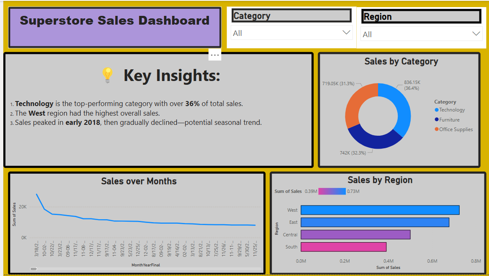

# TASK-8
Task 8: Superstore Sales Dashboard using Power BI
📝 Task Summary
In this task, I designed an interactive and visually appealing sales dashboard using Power BI to analyze performance by product category, region, and monthly trends.
The data was extracted from the Superstore_Sales.csv file, and multiple chart types were used to summarize sales insights for business decision-making.

📁 Dataset Used
Superstore_Sales.csv
🧾 Columns: Order Date, Region, Category, Sales, Profit

🔧 Tools & Process
🛠 Tool Used: Power BI
🧹 Data Cleaning: Basic formatting of Order Date
📆 Converted Order Date to Month-Year format
📊 Created 3 Visualizations:
Line Chart: Monthly Sales Trend 📈
Bar Chart: Sales by Region 🗺️
Donut Chart: Sales by Category 🍩
🎛️ Added Region slicer for interactivity
🎨 Used colors to highlight high-performing segments
📷 Executed Dashboard (Screenshot)

💡 Key Insights from the Dashboard
🔹 Insight 1:
💻 Technology is the leading product category, contributing 36% of total sales. It indicates strong interest in tech-related purchases.

🔹 Insight 2:
🌍 The West Region dominates in total sales, reflecting better performance and possible market maturity in that area.

🔹 Insight 3:
🎄 A significant sales peak occurred in December, revealing a clear seasonal trend—likely tied to year-end shopping.

🔹 Insight 4:
📉 The South Region consistently reports the lowest sales, suggesting the need for targeted campaigns or product re-alignment.

💡 Business Tip:
Focus marketing strategies on underperforming regions (like South), and prepare inventory in advance for December spikes.
